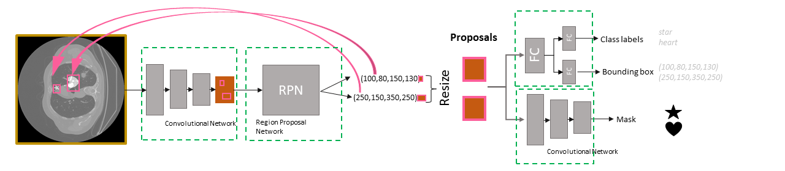

# Building a Mask R-CNN from scratch using TensorFlow and Keras
Tested in TensorFlow 2.4.1 \
Article about the content of this repository: https://medium.com/@rajkifranciska/building-a-mask-r-cnn-from-scratch-in-tensorflow-and-keras-c49c72acc272

## 1. Files:
- GenerateToyDataset_fromscratch.ipynb: script to generate toydataset using the masks, and LIDC-IDRI dataset. 
- ./masks/: folder containing two mask files to generate toydataset
(You need to download the LIDC-IDRI dataset, and have a config file as defined here:https://pylidc.github.io/install.html)

- MaskrCNN.ipynb: creating and training a Mask R-CNN from scratch, using the toydataset. All networks and trainsteps can be observed here.
- MaskrCNN_call.ipynb: Generating and training a new Mask R-CNN, or finetuning saved models can be done here. No functions defined here.

- model_utils.py: training/model functions like: creating network, batchgenerator, trainstep, trainloop, predict, losses are found here. 
- utils.py:   calculating helper functions + visualization functions are here

If you use my toydataset generation, you will need a path to:
  1. the CT slices
  2. the normalized CT slices
  3. the toydataset, which has to include an images and a masks folder

## 2. Necessary packages you might not have: 
- to work with the nrrd files install pynrrd
- to work with LIDC-IDRI install pylidc

## 3. Citation

@misc{franciskarajki_maskrcnn_2021,\
  title={Building a Mask R-CNN from scratch using TensorFlow and Keras},\
  author={Franciska Rajki},\
  year={2021},\
  publisher={Github},\
  journal={GitHub repository},\
  howpublished={\url{https://github.com/rajkifranciska/maskrcnn-from-scratch}}, \
}

Franciska Rajki, Ulyssys Ltd. https://ulyssys.hu/

